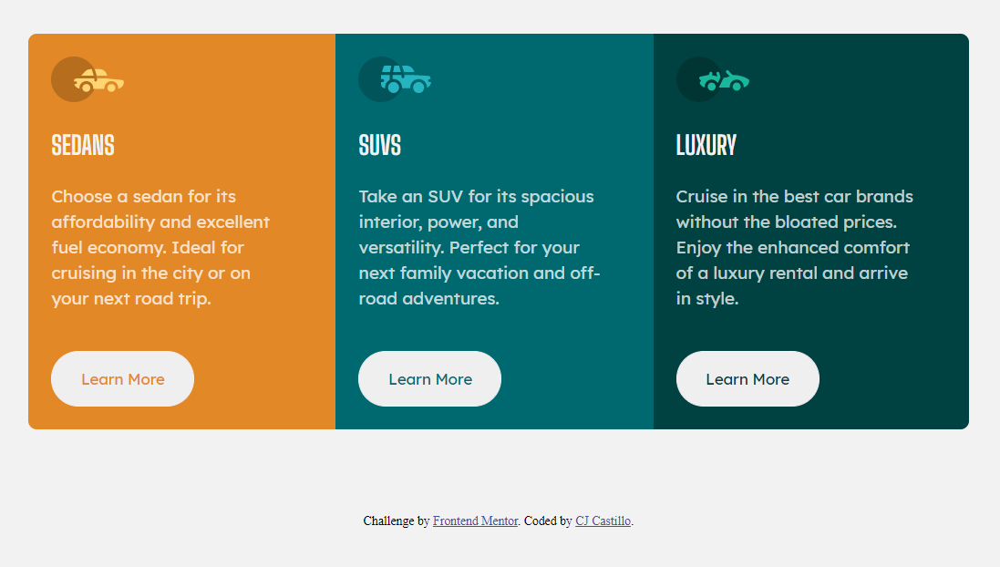

# Frontend Mentor - 3-column preview card component challege

## Welcome! 👋

**To do this challenge, you need a basic understanding of HTML, CSS and JavaScript.**

## The challenge

Your challenge is to build out this 3-column preview card component and get it looking as close to the design as possible.

You can use any tools you like to help you complete the challenge. So if you've got something you'd like to practice, feel free to give it a go.

Your users should be able to:

- View the optimal layout depending on their device's screen size
- See hover states for interactive elements

## Screenshot of my 3-column preview card component

## Built with

- Semantic HTML5 markup
- CSS custom properties
- Flexbox
- CSS Grid
- Mobile-first workflow

My code editor used is Visual Studio Code

## Useful Resources

- [W3Schools](https://www.w3schools.com/)
- [CSS-Tricks](https://css-tricks.com/snippets/css/a-guide-to-flexbox/)

## Links

- Solution URL: [My solution](https://github.com/caytejohn/column-preview-card-component)
- Live Site URL: [Live site](https://caytejohn.github.io/column-preview-card-component/)

## Author

- Frontend Mentor - [@caytejohn](https://www.frontendmentor.io/profile/caytejohn)
- Github - [@caytejohn](https://github.com/caytejohn)

**Have fun building!** 🚀
